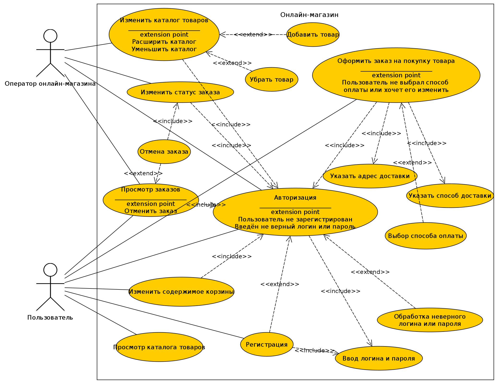

## Спецификация варинтов использования

1. Название: «Оформление заказа на покупку товара»

2. Краткое описание: Просит пользователя авторизоваться, если он этого не сделал, затем оформляет заказ на покупку товара/товаров с выбором способа и указанием адреса доставки. Если пользователь не выбрал способ оплаты товара или хочет изменить его, то просит выбрать способ оплаты. 

3. Предварительные условия: Выбранный товар/товары должны быть в наличии на складе.

4. Основной поток: Пользователь онлайн-магазина переходит на соответствующую страницу сайта онлайн-магазина (корзина товаров) и нажимает на нужную кнопку («Оформить заказ»). Далее система проверяет авторизован ли пользователь и выводит форму для заполнения пользователю со следующими полями: 

    1. Способ оплаты. Требуется выбрать способ оплаты, например, PayPal или кредитную карту. Данное поле заполнено автоматически, если пользователь заранее указывал способ оплаты в настройках своего аккаунта.

    2. Адрес доставки. Требуется указать страну, регион, город, улицу и почтовый индекс.

    3. Способ доставки. Нужно выбрать один из заранее предусмотренных магазином способо	в доставки.
   
   При корректности введённых пользователем данных, заказ успешно оформляется и добавляется в базу данных онлайн-магазина. Далее заказ становится доступным для просмотра пользователю, т.е. он может посмотреть указанные им при оформлении заказа данные, квитанцию об оплате или промониторить, где сейчас находится заказанный(ые) им товар/товары.

5. Альтернативный поток: Если пользователь при оформлении заказа не авторизован, система просит его авторизоваться. Если он не указал способ оплаты, система просит выбрать способ оплаты.

6. Постусловия: После оформления заказа система возвращает пользователя на главную страницу онлайн-магазина.

### Диаграмма  вариантов использований

